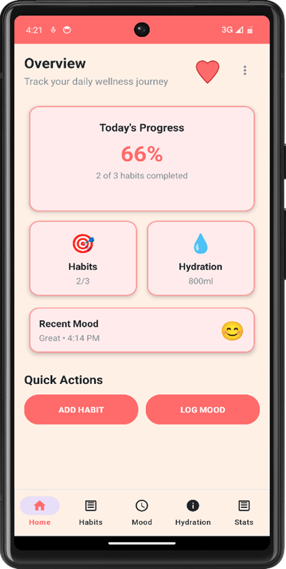
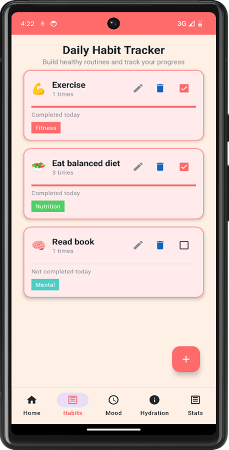
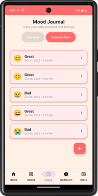
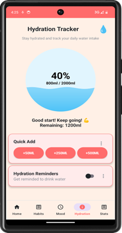
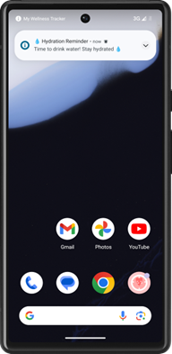

# Habit Tracker - Wellness App



## 📱 Features
| Feature | Description |
|---------|-------------|
| ✅ **Daily Habit Tracker** | Track habits: Drink Water, Meditate, Exercise, Read, Sleep |
| 😊 **Mood Journal** | Log daily moods with emoji selector (😊 😐 😢 😡 🥰 😴) |
| 💧 **Hydration Reminder** | Customizable water intake notifications via AlarmManager |
| 📊 **Home Widget** | View today's habit completion progress from home screen |

## 🛠️ Tech Stack
| Component | Technology |
|-----------|------------|
| **Language** | Kotlin |
| **IDE** | Android Studio |
| **Minimum SDK** | API 24 (Android 7.0) |
| **Persistence** | SharedPreferences |
| **Notifications** | AlarmManager, WorkManager |
| **UI** | Material Design, XML |

## 📸 Screenshots

| Habits Tracker | Mood Journal | Hydration Reminder | Home Widget |
|----------------|--------------|-------------------|-------------|
|  |  |  |  |

*Click screenshots to enlarge*

## 📋 Assignment Requirements

| Requirement | Status |
|------------|--------|
| Daily Habit Tracker (Add/Edit/Delete) | ✅ Complete |
| Mood Journal with Emoji Selector | ✅ Complete |
| Hydration Reminder with Notifications | ✅ Complete |
| Advanced Feature: Home Screen Widget | ✅ Complete |
| SharedPreferences Data Persistence | ✅ Complete |
| Fragments/Activities Navigation | ✅ Complete |
| Responsive UI (Phone/Tablet) | ✅ Complete |

## 🚀 Quick Start

```bash
# Clone repository
git clone https://github.com/TriveniTheaver/Habit-Tracker-App.git

# Open in Android Studio
# File → Open → Select project folder

# Build and run
# Click Run ▶️ button|

